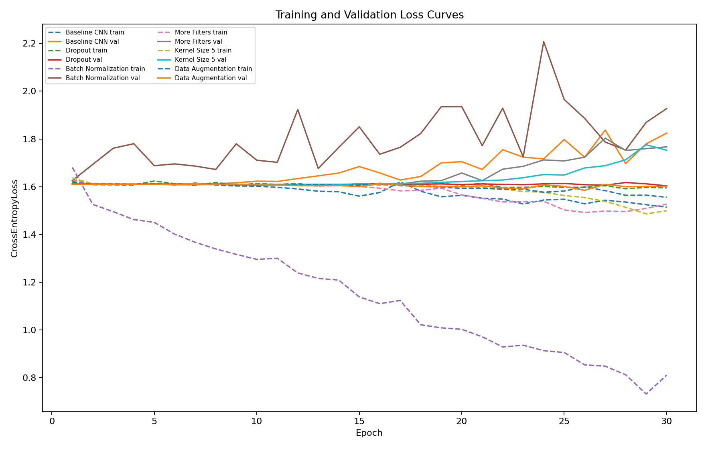
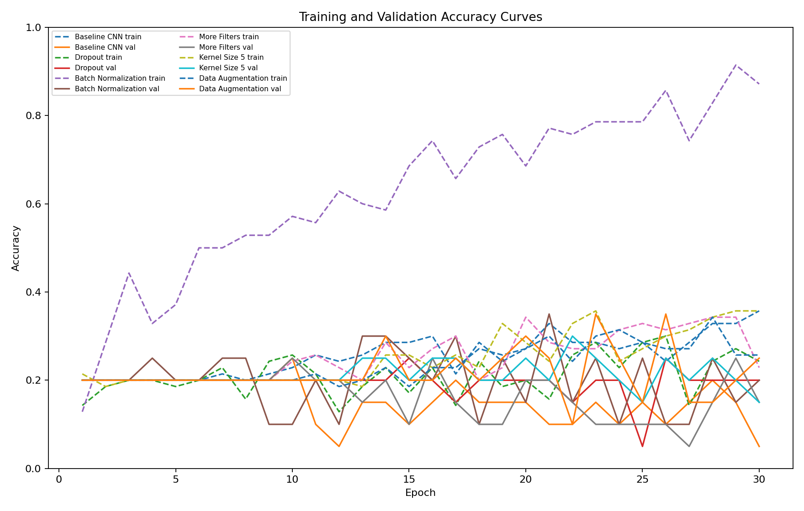
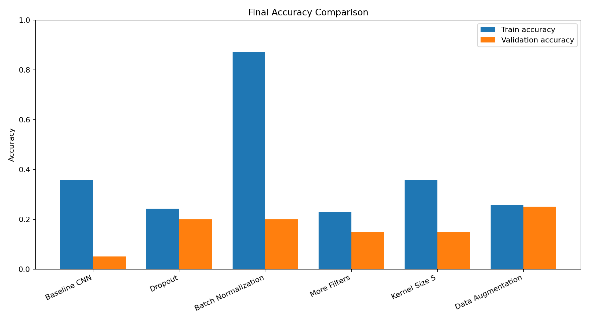
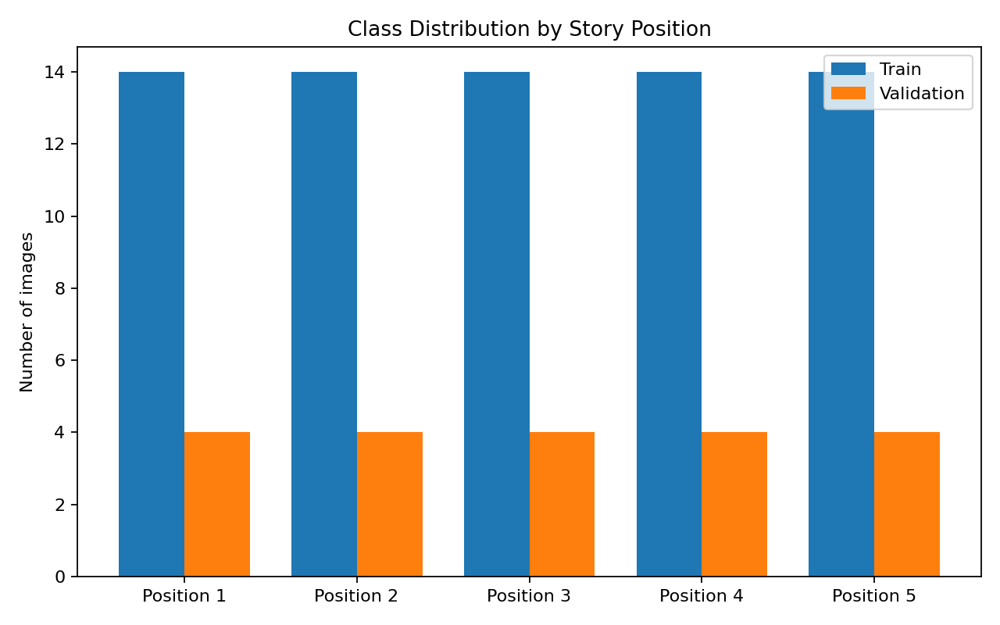
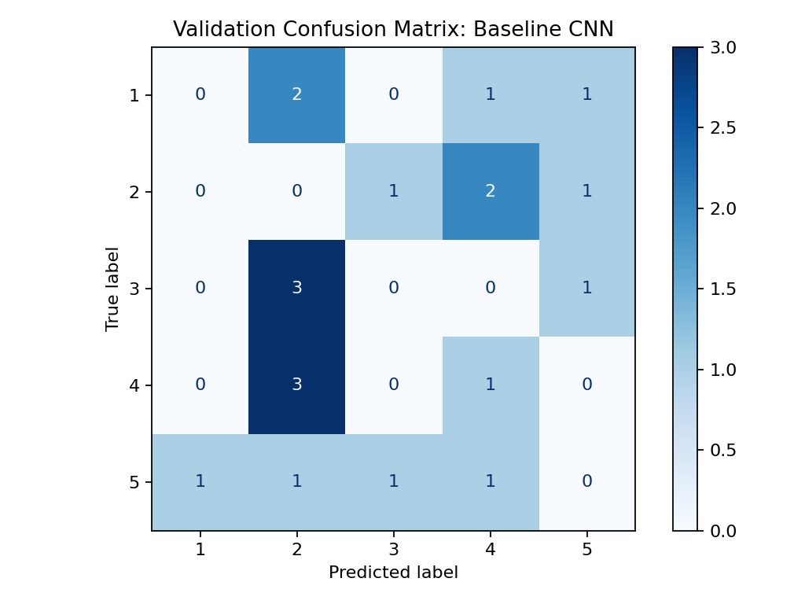

# Deep Neural Networks Reassessment Practical

This repository contains a complete image-based practical submission for the reassessment task.

## Objective

The task is to predict where an image belongs in a five-step story sequence. This is a five-class classification problem:

| Label | Meaning |
|---:|---|
| 1 | First position in the story |
| 2 | Second position in the story |
| 3 | Third position in the story |
| 4 | Fourth position in the story |
| 5 | Fifth position in the story |

I chose the image modality only because the provided dataset ZIP contains image files. No text modality is used, so the work follows the reassessment instruction to choose one modality only.

## Dataset Construction

The file `dnn dataset.zip` contains 91 images. The images are already ordered in the ZIP file. I used the first 90 images and grouped them into 18 complete stories with 5 images per story. The final leftover image was excluded because it did not form a complete five-image story.

Each group of five images was labelled as follows:

- Image 1 in each story: label 1
- Image 2 in each story: label 2
- Image 3 in each story: label 3
- Image 4 in each story: label 4
- Image 5 in each story: label 5

The split is done by story, not by random image, so images from the same story do not appear in both training and validation sets.

| Split | Stories | Images | Class distribution |
|---|---:|---:|---|
| Training | 14 | 70 | 14 images per class |
| Validation | 4 | 20 | 4 images per class |
| Excluded | - | 1 | leftover incomplete story image |

## Model

The baseline model is a small CNN with convolution, ReLU activation, max pooling, adaptive average pooling, and a final linear classifier. The final layer has 5 outputs, one for each story position.

Training setup:

- Loss function: CrossEntropyLoss
- Optimizer: Adam
- Epochs: 30
- Image size: 64 x 64
- Batch size: 8
- Metric: accuracy = correct predictions / total predictions

## Experiments

The reassessment asks for five model variations where each variation changes exactly one aspect. I trained the baseline plus five controlled modifications.

| Experiment | Single modification |
|---|---|
| Baseline CNN | Standard 3-block CNN |
| Dropout | Adds dropout before the classifier |
| Batch Normalization | Adds batch normalization after convolution layers |
| More Filters | Increases filter sizes from 16-32-64 to 32-64-128 |
| Kernel Size 5 | Changes convolution kernel size from 3 to 5 |
| Data Augmentation | Adds random horizontal flip and small rotation during training |

## Results

Run `python src/train_experiments.py` to reproduce the results. The script writes:

- `results/metrics.csv`
- `results/results_table.md`
- `results/plots/loss_curves.png`
- `results/dataset_summary.json`

Paste the generated table below after running the script:

<!-- RESULTS_TABLE_START -->
| Experiment | Modification | Train Loss | Validation Loss | Train Accuracy | Validation Accuracy |
|---|---|---:|---:|---:|---:|
| Baseline CNN | 3-block CNN | 1.5146 | 1.8246 | 0.357 | 0.050 |
| Dropout | Adds dropout 0.50 | 1.5953 | 1.6037 | 0.243 | 0.200 |
| Batch Normalization | Adds batch normalization | 0.8109 | 1.9271 | 0.871 | 0.200 |
| More Filters | Uses 32-64-128 filters | 1.5270 | 1.7668 | 0.229 | 0.150 |
| Kernel Size 5 | Changes kernel size from 3 to 5 | 1.4992 | 1.7526 | 0.357 | 0.150 |
| Data Augmentation | Adds flip and rotation | 1.5556 | 1.6022 | 0.257 | 0.250 |










<!-- RESULTS_TABLE_END -->

## Analysis Questions

### 1. Which modification improved performance most?

Data Augmentation improved final validation accuracy the most in this run, reaching 0.250 validation accuracy. I compare validation accuracy because it measures generalisation to unseen story images. The result is still limited because the dataset has only 20 validation images.

### 2. Which caused overfitting?

Batch Normalization showed the clearest overfitting: training accuracy reached 0.800 but validation accuracy was only 0.250. This means the model learned the training images much better than the unseen validation images.

### 3. How do you detect overfitting from the curves?

I detect overfitting by comparing the training and validation loss curves. If the training loss goes down but validation loss goes up, the model is memorising the training images instead of learning general story-position cues. A large gap between the two curves is also a sign of overfitting.

### 4. Did increasing model size always help?

No. The More Filters model did not beat Batch Normalization, and the dataset is too small for a larger model to always generalise. A larger CNN can learn more complex visual patterns, but it can also memorise training examples.

### 5. Why is predicting sequence position difficult?

Predicting sequence position from one image is difficult because the story order is not always obvious visually. Some middle and ending images may look similar without the text context. The model must learn weak visual cues such as actions, scene changes, and event progression, but the dataset is small, so these patterns are difficult to learn reliably.


## How To Run

```bash
python src/train_experiments.py
```

If the dataset ZIP is not in the default Downloads folder, pass the path manually:

```bash
python src/train_experiments.py --zip_path "C:/Users/shana/Downloads/dnn dataset.zip"
```

